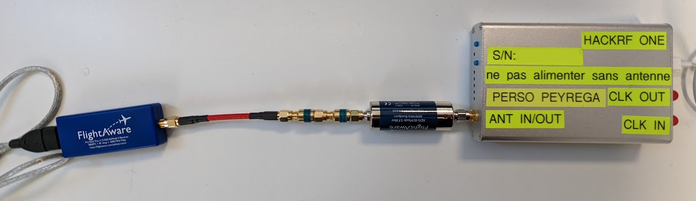
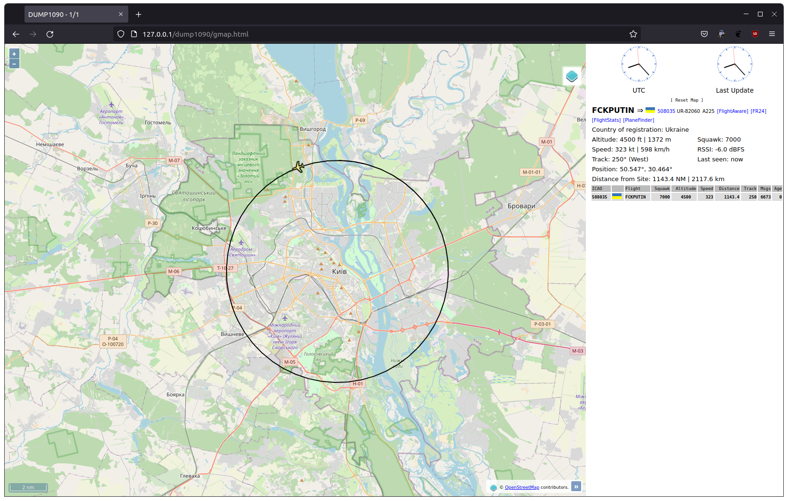
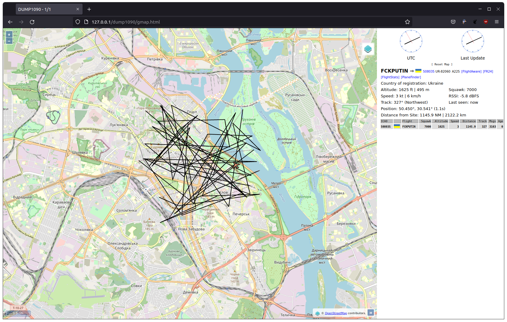
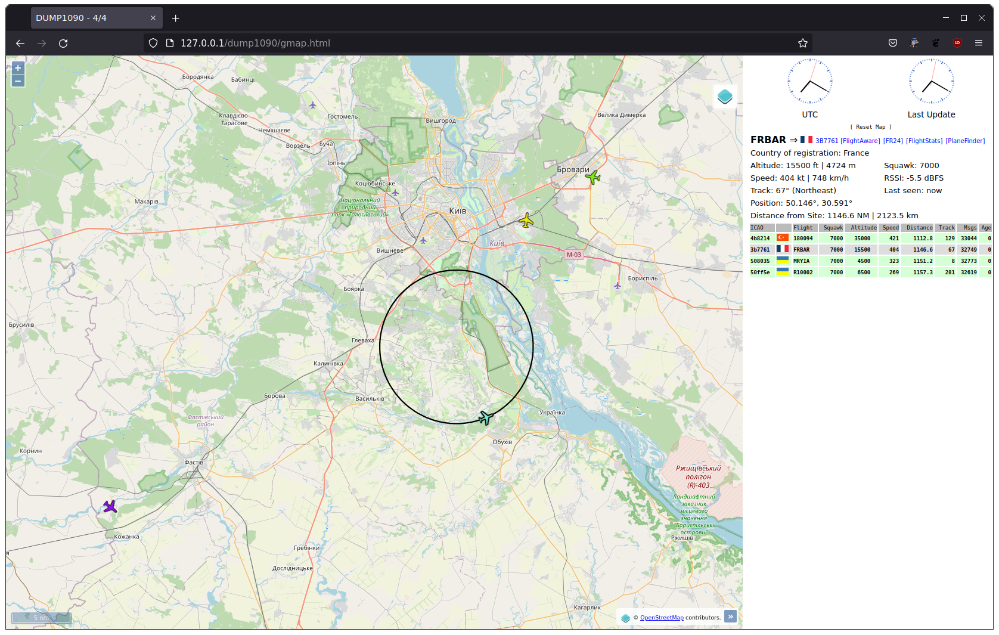

# realtime ADS-B out

## Foreword

This project is inspired and reuse several parts of several other ADS-B / mode S projects amongst which:

- https://github.com/lyusupov/ADSB-Out
- https://github.com/nzkarit/ADSB-Out and https://github.com/pynstrom/adsb-out
- https://github.com/bistromath/gr-air-modes
- https://github.com/junzis/pyModeS

All those repositories are published under GNU General Public License v3.0. This is also the license chosen for this repository.
Please let me know if you have issues or require more explicit citations about reused source code.

I wrote a short article (in french) about how (and why) I used this repository to spoof data on Flightradar24 on the 11th of March 2022:
https://www.linkedin.com/pulse/comment-et-pourquoi-jai-tromp%25C3%25A9-flightradar24-mathieu-peyr%25C3%25A9ga/?trackingId=%2BGNCsBDoBSYuF8W3JPNclw%3D%3D

## Project goals

The initial project goals are oriented towards:

- completing the set of broadcastable messages that have already been implemented "adsb-out" in referenced projects.
- fixing bugs / adding features in existing code.
- producing a software architecture that better suit my understanding/habits.
- beeing able to live feed HackRF through a libhackrf python wrapper layer, rather than generating an IQ sample files that would later be hackrf_transfer'd.

## HackRF python wrapper

HackRF python wrapper `pyhackrf.py` is included in this repository and was also proposed to be merged into hackRF main repository: https://github.com/greatscottgadgets/hackrf/pull/1058 but this has not been accepted. I'll try to keep maintaining it if API of libhackrf change and may think to build a proper independant Python package.
This repo only uses TX feature of the python wrapper, but RX is also possible (see examples in https://github.com/Matioupi/hackrf/tree/python_wrapper/host/python)

## Software architecture

The workflow is divided between 3 execution threads:

- main thread wich performs all initializations and control user inputs (mainly start / stop simulation for now)
- hackrf broadcasting thread which pump encoded messages and send them over the air with a predefined schedule
- trajectory simulation thread which feed brodcasting thread with encoded messages matching a real time simulated trajectory

The message encoding is splitted into mode S "frame encoding" and "low level encoding" which handles PPM modulation and conversion to hackRF IQ sample format.  
Software source code structure tries to reflect those 2 different layers.

So far only "simple" simulated trajectories are available, but one can easily extend/fork behaviour to e.g. have a flight informations coming from a flight simulator (X-plane would be pretty well suited for that purpose through it's UDP aircraft state broadcast facility) or use actual sensors to feed live data.

## Usage and RF broadcast disclaimer

Usage can be demonstrated together with `dump1090-mutability` or `dump1090-fa` and associated webservers or text message views.

Repository source code is tuned for a 1090 MHz brodcast with **direct wire feed** to a receiver SDR dongle (no over the air broadcast).  
The hardware setup I'm using is pictured below. Please note the RF attenuators (-20dB and -30dB).  
The extra 1090MHz filter is probably not requiered as the flight aware dongle already features 1090 MHz filtering.
My HackRF is fitted with a 0.5 ppm TCXO



The default hackrf settings in repo are :
- 1090 MHz
- LNA amplificator disabled
- TX gain 4dB
- Sample rate needs to be 2MHz as this matches the ADS-B specification where PPM symbols last for 0.5 µs.

Actual ADS-B brodcast frequency is 1090MHz which in most if not all places is a reserved band.  
Some critical **flight safety feature** do rely on actual ADS-B broadcasts.  
Unless you have special authorisations, **you should NEVER broadcast over the air at this frequency**.

If you can't use a wired RF feeding between hackRF and your SDR receiver for your test setup, you can easily modify source code in order to use a "fake" free frequency (e.g. 868MHz) and setup dump1090 accordingly to match this "fake" frequency by adding switch `--freq 868000000` to your usual `dump1090` command line. Increasing TX gain may be needed in that use case.

By the way, I believe that the fact that one with 200$ hardware would actually be able to broadcast at 1090MHz and produce some fake ADS-B aircraft tracks highlights a serious weakness in ADS-B design.  
Those forged broadcasts may be used to spoof ATC, trigger TCAS or other malicious behaviours.

## Command line examples

#### *Command line switches can be displayed with*  

```
mathieu@devbox:~/Dev/matioupi/realtime-adsb-out$ ./realtime-adsb-out.py -h
Usage: ./realtime-adsb-out.py [options]

-h | --help              Display help message.
--scenario <opt>         Scenario mode with a provided scenario filepath
--icao <opt>             Callsign in hex, Default:0x508035
--callsign <opt>         Callsign (8 chars max), Default:DEADBEEF
--squawk <opt>           4-digits 4096 code squawk, Default:7000
--trajectorytype <opt>   Type of simulated trajectory amongst :
                           fixed       : steady aircraft
                           circle      : pseudo circular flight
                           random      : random positions inside circle area
                           waypoints   : fly long flight path
                           Default:fixed
--lat <opt>              Latitude for the plane in decimal degrees, Default:50.44994
--long <opt>             Longitude for the place in decimal degrees. Default:30.5211
--altitude <opt>         Altitude in decimal feet, Default:1500.0
--speed <opt>            Airspeed in decimal kph, Default:300.0
--vspeed <opt>           Vertical speed en ft/min, positive up, Default:0
--maxloadfactor          Specify the max load factor for aircraft simulation. Default:1.45
--trackangle <opt>       Track angle in decimal degrees. Default:0
--timesync <opt>         0/1, 0 indicates time not synchronous with UTC, Default:0
--capability <opt>       Capability, Default:5
--typecode <opt>         ADS-B message type, Default:11
--sstatus <opt>          Surveillance status, Default:0
--nicsupplementb <opt>   NIC supplement-B, Default:0
--surface                Aircraft located on ground, Default:False
--waypoints <opt>        Waypoints file for waypoints trajectory
--posrate <opt>          position frame broadcast period in µs, Default: 150000
```

#### *Single plane scenarii can be achieved with command line switches*  

`./realtime-adsb-out.py --callsign 'FCKPUTIN' --alt 4500 --speed 600 --trajectorytype circle --maxloadfactor 1.03`

will generate a pseudo circular trajectory, flown at 4500 ft, 600 km/h and a load factor of 1.03.



`./realtime-adsb-out.py --callsign 'FCKPUTIN' --alt 4500  --trajectorytype random`

will generate a random trajectory in a ~30s at specified (here default) speed around center lat / lon (default here too).  
track angle is randomized, speed is randomized, altitude is randomized. The default position frame broadcast period can be lowered in order to
produce a large numer of tracks in a given area



#### *More complex scenarii with multiple planes can be achieved through json configuration files*  

`./realtime-adsb-out.py --scenario ./examples/scenario3.json`  
  


The maximum number of planes that can be simulated has not been evaluated yet. It will depends on the refresh rate of each message type, etc.
Tests have been performed on a laptop computer, but with not too many tracks, it should be possible to run on lighter platforms such as Raspberry Pi.  

## Reference documentation

All reference documentation from the repositories mentionned in the foreword.

[https://mode-s.org/](https://mode-s.org/)

*ICAO Annex 10, Aeronautical Telecommunications, Volume IV - Surveillance Radar and Collision Avoidance Systems* which at time of writing can be retrieved here:
- english version https://www.bazl.admin.ch/bazl/en/home/specialists/regulations-and-guidelines/legislation-and-directives/anhaenge-zur-konvention-der-internationalen-zivilluftfahrtorgani.html
- french version https://www.bazl.admin.ch/bazl/fr/home/experts/reglementation-et-informations-de-base/bases-legales-et-directives/annexes-a-la-convention-de-l-organisation-internationale-de-l-av.html  

*ICAO doc 9871 edition 1* which can be retrieved here (There is an edition 2 of this document but all seems to be behing paywalls):
- [ICAO doc 9871 edition 1](http://www.aviationchief.com/uploads/9/2/0/9/92098238/icao_doc_9871_-_technical_provisions_for_mode_s_-_advanced_edition_1.pdf)  
  
Ghost in the Air(Traffic): On insecurity of ADS-B protocol and practical attacks on ADS-B devices (Andrei Costin, Aurélien Francillon):
[publication PDF hosted at eurocom.fr](https://www.s3.eurecom.fr/docs/bh12us_costin.pdf)

A DEFCON 20 video on Youtube that already highlighted some ADS-B weaknesses (and at this time, there was no HackRF):
[DEFCON 20 (2012) - RenderMan - Hacker + Airplanes = No Good Can Come Of This](https://www.youtube.com/watch?v=mY2uiLfXmaI)
